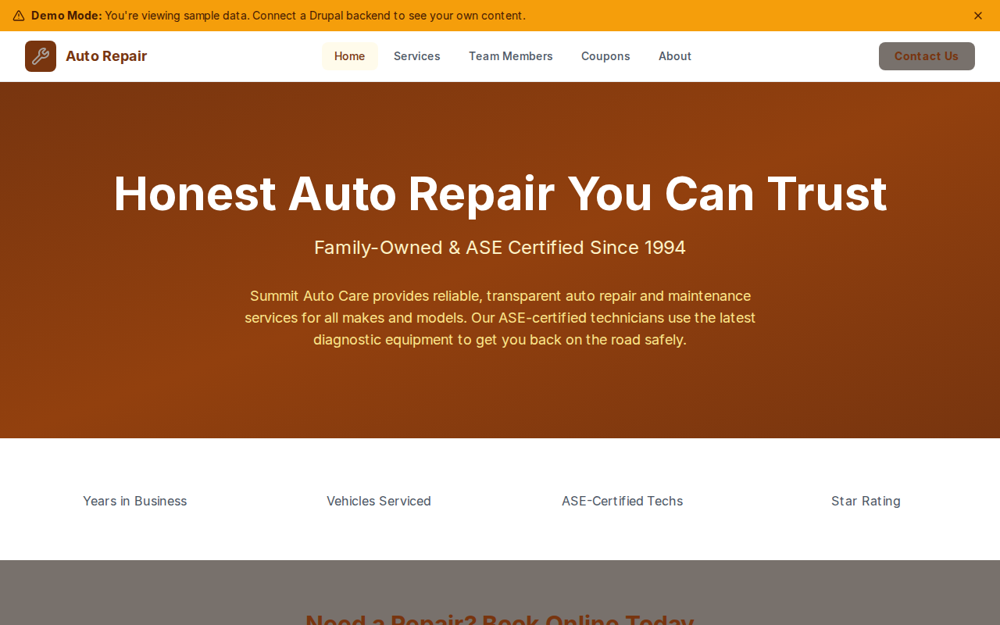

# Decoupled Auto Repair

An auto repair shop website starter template for Decoupled Drupal + Next.js. Built for independent mechanics, auto service centers, and family-owned repair shops showcasing services, team expertise, and promotional offers.



## Features

- **Services** - Present auto repair and maintenance services with pricing, estimated time, and warranty details
- **Team Members** - Showcase ASE-certified mechanics and staff with certifications, specialties, and experience
- **Coupons** - Promote special offers and discounts with codes, expiration dates, and redemption terms
- **Modern Design** - Clean, trustworthy UI optimized for auto service businesses

## Quick Start

### 1. Clone the template

```bash
npx degit nextagencyio/decoupled-auto-repair my-auto-repair
cd my-auto-repair
npm install
```

### 2. Run interactive setup

```bash
npm run setup
```

This interactive script will:
- Authenticate with Decoupled.io (opens browser)
- Create a new Drupal space
- Wait for provisioning (~90 seconds)
- Configure your `.env.local` file
- Import sample content

### 3. Start development

```bash
npm run dev
```

Visit [http://localhost:3000](http://localhost:3000)

---

## Manual Setup

If you prefer to run each step manually:

<details>
<summary>Click to expand manual setup steps</summary>

### Authenticate with Decoupled.io

```bash
npx decoupled-cli@latest auth login
```

### Create a Drupal space

```bash
npx decoupled-cli@latest spaces create "My Auto Repair Shop"
```

Note the space ID returned (e.g., `Space ID: 1234`). Wait ~90 seconds for provisioning.

### Configure environment

```bash
npx decoupled-cli@latest spaces env 1234 --write .env.local
```

### Import content

```bash
npm run setup-content
```

This imports:
- Homepage with hero section, shop statistics, and appointment CTAs
- 3 Services (Full Synthetic Oil Change, Complete Brake Service, Engine Diagnostics & Tune-Up)
- 3 Team Members (Mike Sullivan - owner/master technician, Rachel Torres - diagnostic specialist, James Wright - transmission expert)
- 3 Coupons (Synthetic Oil Change discount, Brake Service savings, New Customer Welcome offer)
- About page and Contact page

</details>

## Content Types

### Service
- **Summary** - Brief service description
- **Price Range** - Service pricing information
- **Estimated Time** - How long the service takes
- **Warranty Information** - Warranty or guarantee details
- **Service Image** - Photo of the service being performed

### Team Member
- **Position** - Staff role or title
- **Certifications** - Professional certifications (ASE, manufacturer-specific)
- **Years of Experience** - Time in the industry
- **Specialties** - Areas of mechanical expertise
- **Photo** - Staff portrait

### Coupon
- **Discount Amount** - Dollar or percentage savings
- **Coupon Code** - Redemption code
- **Valid From / Valid Until** - Offer validity period
- **Terms** - Conditions and restrictions
- **Featured** - Boolean flag for homepage display

## Customization

### Colors & Branding
Edit `tailwind.config.js` to customize colors, fonts, and spacing.

### Content Structure
Modify `data/auto-repair-content.json` to add or change content types and sample content.

### Components
React components are in `app/components/`. Update them to match your design needs.

## Demo Mode

Demo mode allows you to showcase the application without connecting to a Drupal backend.

### Enable Demo Mode

Set the environment variable:

```bash
NEXT_PUBLIC_DEMO_MODE=true
```

### Removing Demo Mode

To convert to a production app with real data:

1. Delete `lib/demo-mode.ts`
2. Delete `data/mock/` directory
3. Delete `app/components/DemoModeBanner.tsx`
4. Remove `DemoModeBanner` from `app/layout.tsx`
5. Remove demo mode checks from `app/api/graphql/route.ts`

## Deployment

### Vercel (Recommended)
[](https://vercel.com/new/clone?repository-url=https://github.com/nextagencyio/decoupled-auto-repair)

Set `NEXT_PUBLIC_DEMO_MODE=true` in Vercel environment variables for a demo deployment.

### Other Platforms
Works with any Node.js hosting platform that supports Next.js.

## Documentation

- [Decoupled.io Docs](https://www.decoupled.io/docs)
- [Next.js Documentation](https://nextjs.org/docs)
- [Drupal GraphQL](https://www.decoupled.io/docs/graphql)

## License

MIT
